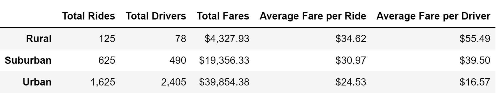
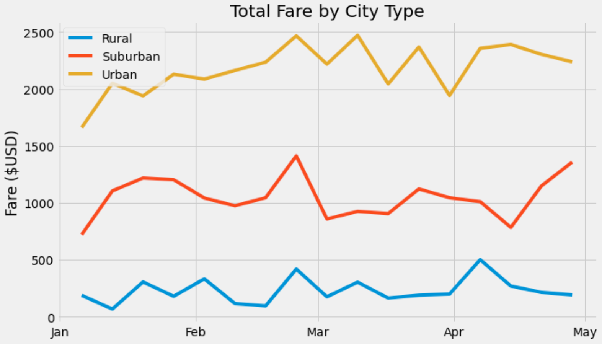

# PyBer Analysis
## Overview of the analysis: 
The $2.3 billion ride-sharing app company PyBer, is currently valued at $2.3 billion. The CEO of PyBer wants a variety of information on ride-sharing data by city type. Additionally, he wants a visualization of the total fares for each city type. The following analysis was conducted on data between the months of January-early May of 2019.

## Results: 
Table 1. displays the total number of rides, total drivers, the sum of all ride fares, the average fare per ride and the average fare per driver. Rural cities have the lowest number of total rides, drivers, and total fares, but the highest average fare per ride and per driver. Urban cities have the highest number of total rides, drivers, and total fares but the lowest average fare per ride and driver. The suburban data falls in between the rural and urban data.

*Table 1.*

The following graph displays the total fare variation between city types. There is a large disparity in total fares with urban cities having the highest total fares, followed by suburban, then rural.

## Summary:  
I recommend adding more drivers to rural cities to see if they can increase total fares and decrease average fare per rider. Additionally, it may be beneficial to add more drivers to suburban cities to see if they can increase total fares and decrease average fare per rider as well. I would then recommend conducting another analysis that compares the supply and demand of PyBer ride-share between city type. I would also recommend running an analysis of fares based on distance to assess how distance affects the cost of rides. This will give the company a better idea of why the fare disparities exist between city types.